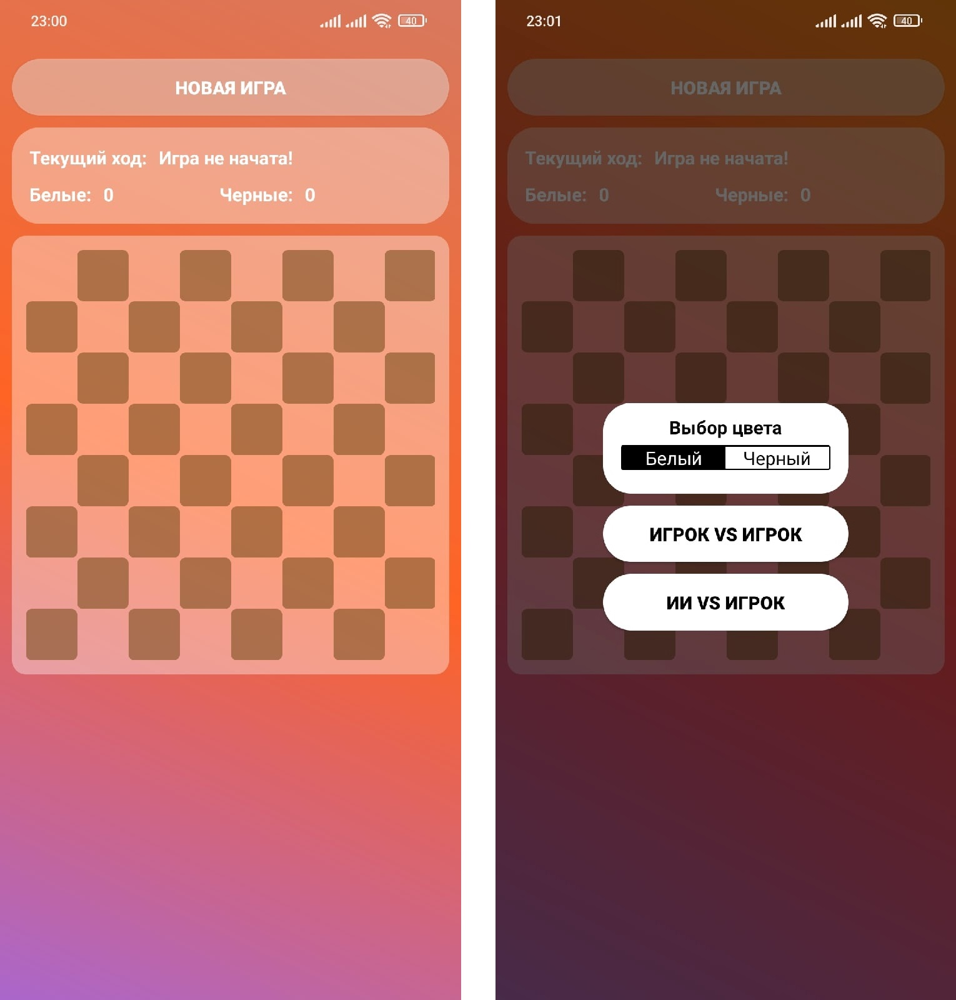
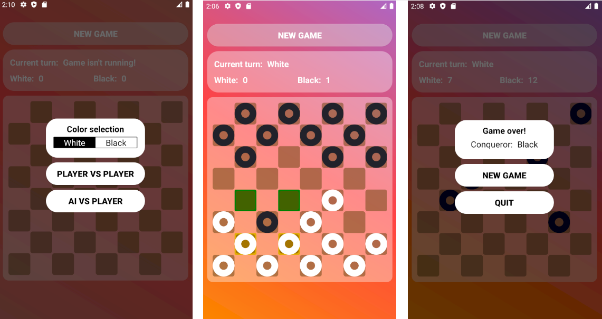

# Russian-checkers-app | Java | Android Studio
Practical part of my first scientific research work, implementation of famous logic game in mobile.

**Checkers AI** is an implemented *minimax algo with alpha-beta-pruning*.
Moves *node tree* builds recursievly every AI's move.
This application has translation into English and Russian (based on system language).

UML class diagram: [Development doc](./dev.md)

**Demonstration screenshots:**

