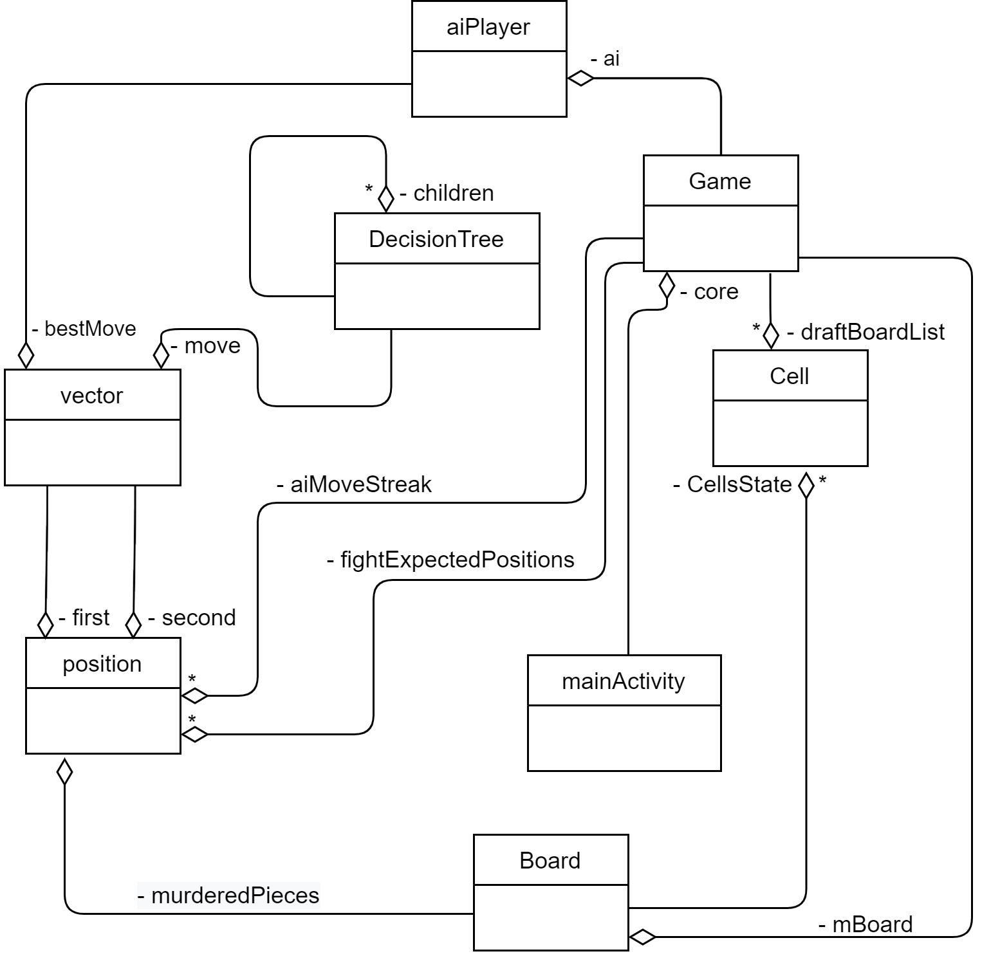

# Russian-checkers-app | Java | Android Studio
You can find UML(Unified Modeling Language) class diagrams of this project here.

Developed classes:
1. Game class: controls the moves of the players, monitors the implementation of the rules of the game, updates the score.
2. MainActivity class: is responsible for the graphical component and implements I/O.
3. Board class: contains a checkerboard and functions for changing its state.
4. Cell class: represents a checkerboard cell.
5. DecisionTree class: designed to create a decision tree, it can contain objects similar to itself.
6. The aiPlayer class: is designed to make a move using the move search algorithm.
7. Class vector: contains the start and end coordinates of the checker's path.
8. The position: class contains the coordinate of the checker on the board.

UML class diagram:
)